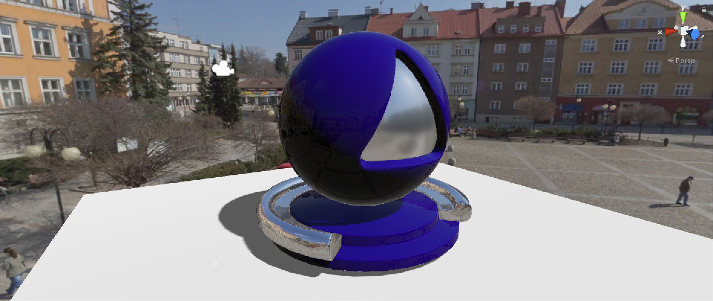
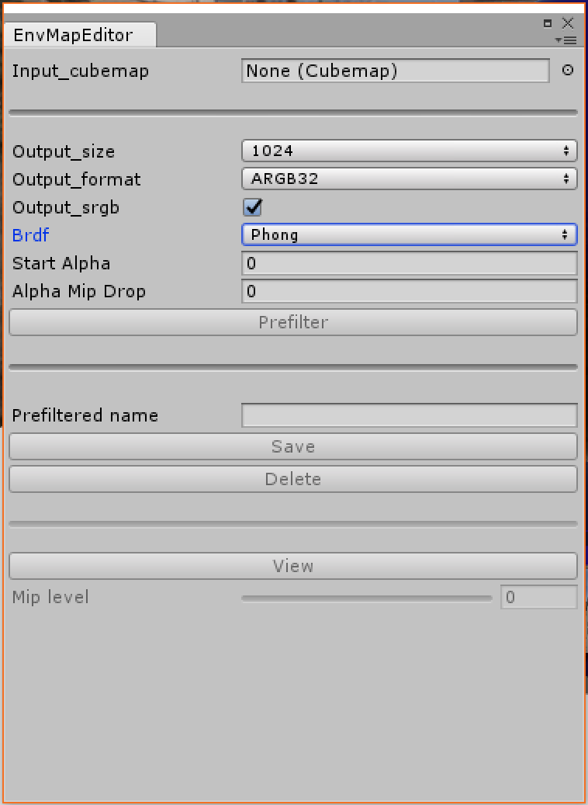

# Unity PBR Envmap Prefilter Tool

  

# Overview
A simple tool for Unity which is useful for prefiltering environment cubemaps and save them with a mip-map chain filled with different values of roughness. At the moment it supports two different possible **PBR BRDFs**: Phong and GGX.

# Usage

  

 - Open the tool selecting **Window/EnvMapEditor**
 - Set the desired parameters:
   - **Output_size**:  it's the power of two size of each cubemap face.
   - **Output_format**: pixel format, usually ARGB32 for LDR images and ARGBFloat for HDR.
   - **Output_srgb**: if the cubemap is linear or gamma corrected.
   - **Brdf**: Phong or GGX.
   - **Start Alpha**: for the Phong brdf, is the starting value of alpha (2048 is a good value).
   - **Alpha Mip Drop**: how much alpha is decreased in each mip level (0.25 is a good value).
- Click **Prefilter**
- Choose a filename, must be a path starting from the Asset folder and with the `.asset` extension e.g. `Assets/Textures/Environment.asset`
- Save
- If you want to see the result, clicking on **View**, the skybox will be replaced with the prefiltered environment, with the slider you can change the showed mip level

## License
This project is licensed under the MIT License - see the [LICENSE](LICENSE.md)
